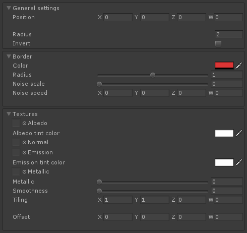

# SphereDissolve [](https://github.com/adultlink) [](http://adultlink.mit-license.org) [](https://www.paypal.me/adultlink/5usd) 


This shader works in a similar way to a typical dissolve shader, albeit with two big differences:

- It makes use of 3D noise instead of a texture, which means:
   - We don't need to care about UVs and seams.
   - The effect is consistent among different objects. They are all affected equally. Quality is also scale-independent.
   - It is a more computationally expensive method.

- The dissolve effect follows a spherical shape, meaning it can be controlled by setting the center and radius of a virtual sphere. This opens up a lot of possibilities.

The shader can be edited through [Amplify Shader Editor](http://amplify.pt/unity/amplify-shader-editor) and contributions to the project are always welcome!

---

Project developed using **Unity 2017.4.8f1**. Please use this version if you are planning on contributing. You can work on your own branch and send a pull request with your changes.

---

You can also just download a **unitypackage** from the [releases tab](https://github.com/AdultLink/SphereDissolve/releases) and easily import everything to your project. This will not download the _media_ folder.

_Disclaimer: The scripts controlling the behavior of the examples provided are not optimized in any way and should only be taken as quick & dirty examples._

Free packages used:

- Interface gallery & freeview icons: [Kenney.nl](https://kenney.nl/)
- Rock models & textures: [Rock and boulders 2](https://assetstore.unity.com/packages/3d/props/exterior/rock-and-boulders-2-6947)
- Skybox: [3Skyboxes](https://assetstore.unity.com/packages/2d/textures-materials/sky/3-skyboxes-25142)

# Table of contents
1. [Getting started](#getting-started)
2. [Parameters list](#parameters-list)
3. [Further reading](#further-reading)
4. [Donate](#donate)
5. [License](#license)

# Getting started

Check the examples included in the project!

These shader comes in two versions; ``SphereDissolve (cutout)`` and ``SphereDissolve``. The former is the one we want to use if we just want to dissolve a mesh, while the latter allows us to dissolve _into_ a secondary texture set.

The following parameters allow us to customize the effect (cutout version):

<p align="center">
   
</p>

``Position`` defines the center of our spherical mask, while ``Radius`` defines its radius. ``Noise scale`` and ``Noise speed`` specify the look of the border. The lower the scale, the rounder it will be. If we want the border to be completely static we should set the speed to (0,0,0,0).

<p align="center">
   
</p>

By activating the ``Invert`` toggle, we can invert the dissolve mask, which means the only visible area is now the one within the radius.

<p align="center">
   
</p>

Lastly, as with the standard shader, we can specify textures for the most common channels. In the case of the "standard" version, parameters are the same, except we have two texture sets. This version of the shader can be used in a clever way to simulate a variety of effects!

<p align="center">
   
</p>

# Parameters list

<details><summary>"Standard" version - Click to expand</summary><p>
 
```C#

//MAIN SETTINGS
_Position
_Radius
_Invert

//BORDER SETTINGS
_Bordercolor
_Borderradius
_Bordernoisescale
_Noisespeed

//TEXTURE SET1 SETTINGS
_Set1_albedo
_Set1_albedo_tint
_Set1_normal
_Set1_emission
_Set1_emission_tint
_Set1_metallic
_Set1_metallic_multiplier
_Set1_smoothness
_Set1_tiling
_Set1_offset

//TEXTURE SET2 SETTINGS
_Set2_albedo
_Set2_albedo_tint
_Set2_normal
_Set2_emission
_Set2_emission_tint
_Set2_metallic
_Set2_metallic_multiplier
_Set2_smoothness
_Set2_tiling
_Set2_offset

```

</p></details>

<details><summary>"Cutout" version - Click to expand</summary><p>

```C#

//MAIN SETTINGS
_Position
_Radius
_Invert

//BORDER SETTINGS
_Bordercolor
_Borderradius
_Bordernoisescale
_Noisespeed

//TEXTURE SETTINGS
_Albedo
_Albedo_tint
_Normal
_Emission
_Emission_tint
_Metallic
_Metallic_multiplier
_Smoothness
_Tiling
_Offset

```

</p></details>

# Further reading

- [Minions Art: Quick Game Art Tips - Unity World Position Shader](https://www.patreon.com/posts/quick-game-art-19355776)
- [Glowfish Interactive: Dissolving the world](http://glowfishinteractive.com/dissolving-the-world-part-1/)

# Donate [](https://www.paypal.me/adultlink/5usd)

This piece of software is offered for free because I believe the gamedev community can benefit from it, and it should not be behind a paywall. I learned from the community, and now I am giving back.

If you would like to support me, donations are very much appreciated, since they help me create more software that I can offer for free.

Thank you very much :)

# License
MIT License

Copyright (c) 2018 Guillermo Angel

Permission is hereby granted, free of charge, to any person obtaining a copy
of this software and associated documentation files (the "Software"), to deal
in the Software without restriction, including without limitation the rights
to use, copy, modify, merge, publish, distribute, sublicense, and/or sell
copies of the Software, and to permit persons to whom the Software is
furnished to do so, subject to the following conditions:

The above copyright notice and this permission notice shall be included in all
copies or substantial portions of the Software.

THE SOFTWARE IS PROVIDED "AS IS", WITHOUT WARRANTY OF ANY KIND, EXPRESS OR
IMPLIED, INCLUDING BUT NOT LIMITED TO THE WARRANTIES OF MERCHANTABILITY,
FITNESS FOR A PARTICULAR PURPOSE AND NONINFRINGEMENT. IN NO EVENT SHALL THE
AUTHORS OR COPYRIGHT HOLDERS BE LIABLE FOR ANY CLAIM, DAMAGES OR OTHER
LIABILITY, WHETHER IN AN ACTION OF CONTRACT, TORT OR OTHERWISE, ARISING FROM,
OUT OF OR IN CONNECTION WITH THE SOFTWARE OR THE USE OR OTHER DEALINGS IN THE
SOFTWARE.
